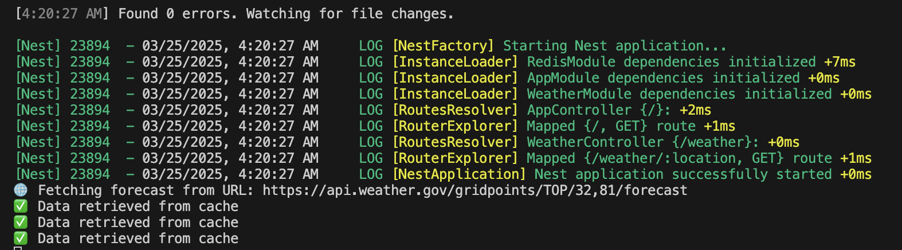

# 🌦️ Weather Data with Redis Cache

This project demonstrates how to fetch weather data from the **National Weather Service API**, store it in a **Redis cache**, and retrieve it to display on a simple web interface. The application is built using **NextJS** and **TypeScript**, with **Docker** for containerizing the Redis instance.

## 🚀 Tech Stack

- **NextJS**: Frontend framework for building React applications with server-side rendering.
- **TypeScript**: For strong typing and enhanced code quality.
- **Redis**: Used as a caching layer to store and retrieve weather data.
- **Docker**: To containerize the Redis instance.
- **Axios**: For making HTTP requests to the National Weather Service API.
- **ioredis**: Redis client for Node.js and TypeScript.
- **Jest**: For unit and integration testing.
- **Supertest**: For end-to-end API testing.
- **Curl**: For manual API testing.

## 🗃️ Project Structure

```
├── src
│   ├── api
│   │   └── weather.ts     # Fetch weather data from the API
│   ├── cache
│   │   └── redis.ts       # Redis client configuration
│   ├── components
│   │   └── WeatherDisplay.tsx # Component to display weather data
│   ├── pages
│   │   └── index.tsx      # Main page to show the weather data
│   ├── services
│   │   └── weatherService.ts # Weather data processing logic
├── tests
│   └── weather.test.ts    # Unit and integration tests
├── Dockerfile             # Docker configuration for NextJS
├── docker-compose.yml     # Compose file to spin up Redis container
├── package.json           # Project dependencies and scripts
└── README.md              # Project documentation
```

## 📝 Prerequisites

- **Node.js v18.x or later**
- **Docker**
- **Redis**
- **Git**

## ⚙️ Installation

1. Clone the repository:
   ```bash
   git clone https://github.com/yourusername/weather-redis.git
   cd weather-redis
   ```

2. Install dependencies:
   ```bash
   npm install
   ```

3. Start the Redis container using Docker:
   ```bash
   docker run --name redis-container -p 6379:6379 -d redis
   ```

## 🌍 Environment Variables

Create a `.env` file in the root directory:

```
REDIS_HOST=localhost
REDIS_PORT=6379
CACHE_TTL=3600
WEATHER_API_BASE_URL=https://api.weather.gov
```

## 🏃 Running the Application

Start the development server:
```bash
npm run start:dev
```

The application will be running at `http://localhost:3000`.

## 🧪 Unit Testing

Run unit tests using Jest:
```bash
npm run test
```

## 🔍 End-to-End Testing (E2E)

Run integration and E2E tests:
```bash
npm run test:e2e
```

## 🐳 Docker Compose Launch

To spin up the entire stack using Docker Compose, use:
```bash
docker-compose up --build
```

## 🛠️ Manual API Testing with Curl

1. Test the root endpoint:
   ```bash
   curl -X GET http://localhost:3000/
   ```
   Expected output:
   ```
   Hello World!
   ```

2. Test the weather endpoint:
   ```bash
   curl -X GET http://localhost:3000/weather/39.7456,-97.0892
   ```
   Expected output:
   ```json
   {
     "properties": {
       "temperature": 25,
       "windSpeed": "15 mph",
       "humidity": "60%"
     }
   }
   ```

3. 

## 🗃️ Redis Cache Testing

1. Connect to the Redis CLI:
   ```bash
   docker exec -it redis-container redis-cli
   ```

2. Get cached weather data:
   ```bash
   GET weather:39.7456,-97.0892
   ```

3. Clear the cache:
   ```bash
   DEL weather:39.7456,-97.0892
   ```

## 📝 License
This project is licensed under the MIT License.

